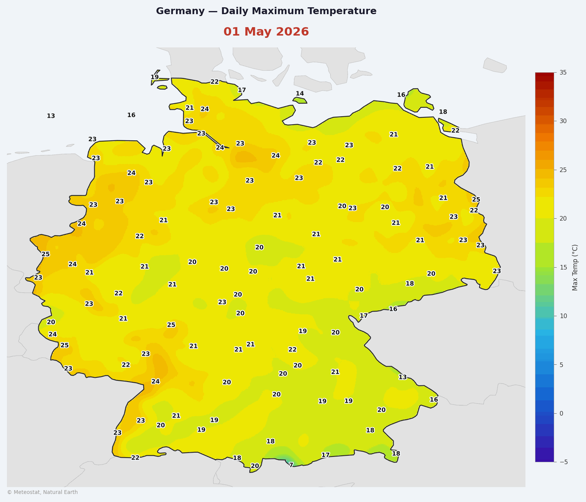

# Animated Temperature Heatmap

This recipe walks through creating an animated GIF of Germany's daily maximum temperature (`tmax`) for a given month. It combines Meteostat's [daily Parquet dataset](/data/bulk/daily) with SciPy spatial interpolation and Matplotlib rendering to produce a smooth, day-by-day temperature map.

<details>

<summary>Full Script</summary>

```python
"""
Generate an animated GIF of Germany's daily maximum temperature (tmax).

Data sources:
  - Station metadata    : Meteostat stations.db
  - Daily observations  : Meteostat daily parquet (one file per year)
  - Country / state borders : Natural Earth 50 m cultural shapefiles

Usage:
    python generate_germany_tmax_gif.py
"""

import io
import os
import pathlib
import sqlite3
import tempfile
import urllib.request
import warnings
import zipfile

import geopandas as gpd
import matplotlib
import matplotlib.patheffects as pe
import matplotlib.pyplot as plt
import numpy as np
import pandas as pd
import requests
import shapely
from matplotlib.collections import PatchCollection
from matplotlib.colors import LinearSegmentedColormap
from matplotlib.patches import Polygon as MplPolygon
from matplotlib.ticker import MultipleLocator
from PIL import Image
from scipy.interpolate import griddata
from scipy.ndimage import gaussian_filter

warnings.filterwarnings("ignore")
matplotlib.use("Agg")

# ── Configuration ─────────────────────────────────────────────────────────────

YEAR  = 2026
MONTH = 5   # 1 = January … 12 = December

OUTPUT_PATH = pathlib.Path(__file__).with_name(
    f"germany_tmax_{YEAR}_{MONTH:02d}.gif"
)

# Map bounding box (WGS 84 lon/lat)
LON_MIN, LAT_MIN, LON_MAX, LAT_MAX = 5.5, 47.0, 15.5, 55.5
GRID_RES = 500   # interpolation grid points per axis

# Temperature colour scale; each colour is paired with an approximate °C anchor
TEMP_COLORS = [
    "#3B0DA6",  # -5 °C  deep violet
    "#1464D2",  #  5 °C  royal blue
    "#28B4E6",  # 12 °C  sky blue
    "#A0E632",  # 18 °C  yellow-green
    "#F5E900",  # 24 °C  golden yellow
    "#F07800",  # 30 °C  deep orange
    "#9B0000",  # 35 °C  dark red
]
VMIN, VMAX = -5, 35

# Minimum spacing (degrees) between temperature labels — one per grid cell
LABEL_GRID_LON = 0.9
LABEL_GRID_LAT = 0.6

# ── Helpers ───────────────────────────────────────────────────────────────────

def download_ne(scale, category, name, tmpdir):
    """Download and unzip a Natural Earth shapefile; return the .shp path."""
    url = f"https://naciscdn.org/naturalearth/{scale}/{category}/{name}.zip"
    zip_path = os.path.join(tmpdir, f"{name}.zip")
    urllib.request.urlretrieve(url, zip_path)
    out = os.path.join(tmpdir, name)
    os.makedirs(out, exist_ok=True)
    with zipfile.ZipFile(zip_path) as zf:
        zf.extractall(out)
    return next(pathlib.Path(out).rglob("*.shp"))


def iter_parts(geom):
    """Yield individual polygon parts from a (possibly Multi-) geometry."""
    yield from (geom.geoms if hasattr(geom, "geoms") else [geom])


def extract_coords(geodataframe):
    """Return exterior coordinate arrays for all polygon parts in a GeoDataFrame."""
    return [
        np.column_stack(part.exterior.xy)
        for geom in geodataframe.geometry.dropna()
        for part in iter_parts(geom)
    ]


# ── 1. Station metadata ───────────────────────────────────────────────────────

print("Downloading stations.db …")
r = requests.get("https://data.meteostat.net/stations.db", timeout=60)
with tempfile.NamedTemporaryFile(suffix=".db", delete=False) as f:
    f.write(r.content)
    db_tmp = f.name

con = sqlite3.connect(db_tmp)
de_stations = pd.read_sql(
    "SELECT id AS station, latitude AS lat, longitude AS lon "
    "FROM stations WHERE country = 'DE'",
    con,
).set_index("station")
con.close()
os.unlink(db_tmp)
print(f"  {len(de_stations)} German stations found")

# ── 2. Daily observations ─────────────────────────────────────────────────────

print(f"Downloading daily parquet ({YEAR}) …")
r = requests.get(f"https://data.meteostat.net/daily/{YEAR}.parquet", timeout=120)
df = pd.read_parquet(io.BytesIO(r.content), columns=["station", "date", "tmax"])

df = df[df["station"].isin(de_stations.index)].copy()
df = df.dropna(subset=["tmax"])
df["date"] = pd.to_datetime(df["date"])
df = df.merge(de_stations[["lat", "lon"]], left_on="station", right_index=True)
print(f"  {len(df):,} rows for Germany")

# ── 3. Geographic data ────────────────────────────────────────────────────────

print("Downloading Natural Earth 50 m boundaries …")
tmpdir = tempfile.mkdtemp()

countries_shp = download_ne("50m", "cultural", "ne_50m_admin_0_countries", tmpdir)
states_shp    = download_ne("50m", "cultural", "ne_50m_admin_1_states_provinces", tmpdir)

world     = gpd.read_file(countries_shp)
germany   = world[world["SOVEREIGNT"] == "Germany"]
de_states = gpd.read_file(states_shp).query("admin == 'Germany'")

# Natural Earth has used "Czechia" since ~2016; accept both spellings
NEIGHBORS = {
    "France", "Netherlands", "Belgium", "Luxembourg",
    "Denmark", "Poland", "Czechia", "Czech Republic",
    "Austria", "Switzerland", "Liechtenstein", "Italy",
}
neighbors = world[world["SOVEREIGNT"].isin(NEIGHBORS)]

# ── 4. Interpolation grid & land mask ────────────────────────────────────────

grid_lon = np.linspace(LON_MIN, LON_MAX, GRID_RES)
grid_lat = np.linspace(LAT_MIN, LAT_MAX, GRID_RES)
glon, glat = np.meshgrid(grid_lon, grid_lat)

# Boolean mask: True where a grid point lies inside Germany
germany_union = germany.geometry.union_all()
mask = shapely.contains_xy(germany_union, glon.ravel(), glat.ravel()).reshape(glon.shape)

# ── 5. Figure geometry ────────────────────────────────────────────────────────
#
# Pre-compute layout constants so the map axes fills its allocated fraction
# at equal aspect with no wasted whitespace.
#
#   map height (in) = map width (in) × (lat_range / lon_range)
#   figure height   = map height + top margin (title) + bottom margin (credit)

FIG_W      = 11.0   # figure width in inches
MAP_W_FRAC = 0.82   # fraction of figure width occupied by the map axes
MAP_LEFT   = 0.01

lon_range = LON_MAX - LON_MIN
lat_range = LAT_MAX - LAT_MIN

map_w_in = FIG_W * MAP_W_FRAC
map_h_in = map_w_in * (lat_range / lon_range)

TOP_IN    = 0.80   # inches reserved for the title block
BOTTOM_IN = 0.22   # inches reserved for the credit line
FIG_H = map_h_in + TOP_IN + BOTTOM_IN

MAP_BOTTOM = BOTTOM_IN / FIG_H
MAP_H_FRAC = map_h_in / FIG_H

CBAR_GAP    = 0.015
CBAR_W_FRAC = 0.030
CBAR_LEFT   = MAP_LEFT + MAP_W_FRAC + CBAR_GAP
CBAR_BOTTOM = MAP_BOTTOM + 0.05
CBAR_HEIGHT = MAP_H_FRAC - 0.10

# ── 6. Pre-compute static geometry ───────────────────────────────────────────

temp_cmap = LinearSegmentedColormap.from_list("tmax", TEMP_COLORS, N=512)

# Extract polygon coordinate arrays once; MplPolygon objects are recreated
# each frame because PatchCollection takes ownership of its patches.
neighbor_coords = extract_coords(neighbors)
state_coords    = extract_coords(de_states)
germany_coords  = extract_coords(germany)

# ── 7. Render frames ──────────────────────────────────────────────────────────

dates = sorted(d for d in df["date"].dt.date.unique() if d.month == MONTH)
print(f"Rendering {len(dates)} frames  (figure {FIG_W:.1f}\" × {FIG_H:.1f}\")")

frames = []

for i, day in enumerate(dates):
    day_df = df[df["date"].dt.date == day]
    if len(day_df) < 10:
        continue

    points = day_df[["lon", "lat"]].values
    values = day_df["tmax"].values

    # Bilinear interpolation with nearest-neighbour fallback for edge gaps,
    # then Gaussian smoothing to reduce point artefacts around sparse stations
    grid_z    = griddata(points, values, (glon, glat), method="linear")
    grid_z_nn = griddata(points, values, (glon, glat), method="nearest")
    grid_z    = np.where(np.isnan(grid_z), grid_z_nn, grid_z)
    grid_z    = gaussian_filter(grid_z, sigma=5)
    grid_z_masked = np.where(mask, grid_z, np.nan)

    # ── figure setup ─────────────────────────────────────────────────────────
    fig = plt.figure(figsize=(FIG_W, FIG_H), dpi=150, facecolor="#F0F4F8")
    ax  = fig.add_axes([MAP_LEFT, MAP_BOTTOM, MAP_W_FRAC, MAP_H_FRAC])
    ax.set_facecolor("#C8DCF0")   # ocean / out-of-bounds colour

    # Neighbouring countries
    ax.add_collection(PatchCollection(
        [MplPolygon(c) for c in neighbor_coords],
        facecolor="#E2E2E2", edgecolor="#BBBBBB", linewidth=0.4, zorder=1,
    ))

    # Temperature heatmap (Gouraud shading for smooth colour transitions)
    im = ax.pcolormesh(
        glon, glat, grid_z_masked,
        cmap=temp_cmap, vmin=VMIN, vmax=VMAX,
        shading="gouraud", zorder=2,
    )

    # Bundesländer borders
    for coords in state_coords:
        ax.plot(*coords.T, color="white", linewidth=0.5, alpha=0.7, zorder=3)

    # Germany outer border
    for coords in germany_coords:
        ax.plot(*coords.T, color="#222222", linewidth=1.1, zorder=4)

    # ── station temperature labels ────────────────────────────────────────────
    # Divide the map into coarse grid cells and keep only the first station per
    # cell so that labels are spread out and don't overlap.
    label_cells = {}
    for _, row in day_df.iterrows():
        cell = (
            int((row["lon"] - LON_MIN) / LABEL_GRID_LON),
            int((row["lat"] - LAT_MIN) / LABEL_GRID_LAT),
        )
        label_cells.setdefault(cell, row)

    outline = [pe.withStroke(linewidth=2.2, foreground="white")]
    for row in label_cells.values():
        if LON_MIN <= row["lon"] <= LON_MAX and LAT_MIN <= row["lat"] <= LAT_MAX:
            ax.text(
                row["lon"], row["lat"], str(int(round(row["tmax"]))),
                ha="center", va="center",
                fontsize=7.5, fontweight="bold", color="#111111",
                path_effects=outline, zorder=5,
            )

    ax.set_xlim(LON_MIN, LON_MAX)
    ax.set_ylim(LAT_MIN, LAT_MAX)
    ax.set_aspect("equal")
    ax.axis("off")

    # ── colorbar ─────────────────────────────────────────────────────────────
    cbar_ax = fig.add_axes([CBAR_LEFT, CBAR_BOTTOM, CBAR_W_FRAC, CBAR_HEIGHT])
    cbar = fig.colorbar(im, cax=cbar_ax)
    cbar.set_label("Max Temp (°C)", fontsize=8, color="#333333", labelpad=5)
    cbar.ax.yaxis.set_tick_params(color="#555555", width=0.5)
    cbar.outline.set_edgecolor("#AAAAAA")
    cbar.outline.set_linewidth(0.5)
    plt.setp(cbar.ax.yaxis.get_ticklabels(), color="#333333", fontsize=7.5)
    cbar.ax.yaxis.set_major_locator(MultipleLocator(5))

    # ── title and date ────────────────────────────────────────────────────────
    fig.text(
        MAP_LEFT + MAP_W_FRAC / 2, 1.0 - (TOP_IN * 0.12) / FIG_H,
        "Germany — Daily Maximum Temperature",
        ha="center", va="top", fontsize=12, fontweight="bold", color="#1A1A2E",
    )
    fig.text(
        MAP_LEFT + MAP_W_FRAC / 2, 1.0 - (TOP_IN * 0.55) / FIG_H,
        day.strftime("%d %B %Y"),
        ha="center", va="top", fontsize=15, fontweight="bold", color="#C0392B",
    )

    # ── credit ────────────────────────────────────────────────────────────────
    fig.text(
        MAP_LEFT, (BOTTOM_IN * 0.35) / FIG_H,
        "© Meteostat, Natural Earth",
        ha="left", va="bottom", fontsize=6.5, color="#999999",
    )

    buf = io.BytesIO()
    fig.savefig(buf, format="png", dpi=150, facecolor=fig.get_facecolor(),
                bbox_inches="tight", pad_inches=0.12)
    plt.close(fig)
    buf.seek(0)
    frames.append(Image.open(buf).copy())
    buf.close()

    if (i + 1) % 10 == 0 or (i + 1) == len(dates):
        print(f"  {i + 1}/{len(dates)} frames done")

# ── 8. Save GIF ───────────────────────────────────────────────────────────────

print(f"Saving GIF ({len(frames)} frames) → {OUTPUT_PATH}")
frames[0].save(
    OUTPUT_PATH,
    save_all=True,
    append_images=frames[1:],
    duration=1000,   # ms per frame
    loop=0,          # loop forever
    optimize=False,
)
print("Done!")
```

</details>



## Dependencies {#dependencies}

Install the required packages:

```bash
pip install requests pandas pyarrow geopandas scipy matplotlib pillow shapely
```

| Package                           | Purpose                                      |
| --------------------------------- | -------------------------------------------- |
| `requests` / `pandas` / `pyarrow` | Fetch and read Parquet data                  |
| `geopandas` / `shapely`           | Load shapefiles and build a land mask        |
| `scipy`                           | Spatial interpolation and Gaussian smoothing |
| `matplotlib`                      | Render each map frame                        |
| `pillow`                          | Assemble frames into an animated GIF         |

## Configuration {#configuration}

All tunable parameters live at the top of the script:

```python
import pathlib

YEAR  = 2026
MONTH = 5   # 1 = January … 12 = December

OUTPUT_PATH = pathlib.Path(__file__).with_name(
    f"germany_tmax_{YEAR}_{MONTH:02d}.gif"
)

# Map bounding box (WGS 84 lon/lat)
LON_MIN, LAT_MIN, LON_MAX, LAT_MAX = 5.5, 47.0, 15.5, 55.5
GRID_RES = 500   # interpolation grid points per axis

# Temperature colour scale; each colour is paired with an approximate °C anchor
TEMP_COLORS = [
    "#3B0DA6",  # -5 °C  deep violet
    "#1464D2",  #  5 °C  royal blue
    "#28B4E6",  # 12 °C  sky blue
    "#A0E632",  # 18 °C  yellow-green
    "#F5E900",  # 24 °C  golden yellow
    "#F07800",  # 30 °C  deep orange
    "#9B0000",  # 35 °C  dark red
]
VMIN, VMAX = -5, 35
```

Change `YEAR` and `MONTH` to render any month covered by the dataset.

## Station Metadata {#station-metadata}

The [weather station database](/data/weather-stations#database) is downloaded as a SQLite file. Only German stations (`country = 'DE'`) are retained, keeping just the coordinates needed for the subsequent spatial join.

```python
import io, os, sqlite3, tempfile
import requests
import pandas as pd

r = requests.get("https://data.meteostat.net/stations.db", timeout=60)
with tempfile.NamedTemporaryFile(suffix=".db", delete=False) as f:
    f.write(r.content)
    db_tmp = f.name

con = sqlite3.connect(db_tmp)
de_stations = pd.read_sql(
    "SELECT id AS station, latitude AS lat, longitude AS lon "
    "FROM stations WHERE country = 'DE'",
    con,
).set_index("station")
con.close()
os.unlink(db_tmp)
```

## Daily Observations {#daily-observations}

The [daily bulk endpoint](/data/bulk/daily) provides one Parquet file per year. Only the `tmax` column is read to keep memory usage low, then filtered to German stations and joined with their coordinates.

```python
r = requests.get(f"https://data.meteostat.net/daily/{YEAR}.parquet", timeout=120)
df = pd.read_parquet(io.BytesIO(r.content), columns=["station", "date", "tmax"])

df = df[df["station"].isin(de_stations.index)].copy()
df = df.dropna(subset=["tmax"])
df["date"] = pd.to_datetime(df["date"])
df = df.merge(de_stations[["lat", "lon"]], left_on="station", right_index=True)
```

:::tip
Passing `columns=["station", "date", "tmax"]` to `read_parquet` reads only the three needed columns, significantly reducing I/O for large files.
:::

## Geographic Data {#geographic-data}

Country and state borders come from [Natural Earth](https://www.naturalearthdata.com/) 1:50 m cultural shapefiles. Germany's geometry is also used to build the land mask in the next step.

```python
import urllib.request, zipfile
import geopandas as gpd

def download_ne(scale, category, name, tmpdir):
    url = f"https://naciscdn.org/naturalearth/{scale}/{category}/{name}.zip"
    zip_path = os.path.join(tmpdir, f"{name}.zip")
    urllib.request.urlretrieve(url, zip_path)
    out = os.path.join(tmpdir, name)
    os.makedirs(out, exist_ok=True)
    with zipfile.ZipFile(zip_path) as zf:
        zf.extractall(out)
    return next(pathlib.Path(out).rglob("*.shp"))

tmpdir = tempfile.mkdtemp()
countries_shp = download_ne("50m", "cultural", "ne_50m_admin_0_countries", tmpdir)
states_shp    = download_ne("50m", "cultural", "ne_50m_admin_1_states_provinces", tmpdir)

world     = gpd.read_file(countries_shp)
germany   = world[world["SOVEREIGNT"] == "Germany"]
de_states = gpd.read_file(states_shp).query("admin == 'Germany'")

NEIGHBORS = {
    "France", "Netherlands", "Belgium", "Luxembourg",
    "Denmark", "Poland", "Czechia", "Czech Republic",
    "Austria", "Switzerland", "Liechtenstein", "Italy",
}
neighbors = world[world["SOVEREIGNT"].isin(NEIGHBORS)]
```

## Interpolation {#interpolation}

For each day, station observations are interpolated onto a regular `500 × 500` grid using SciPy's `griddata`. A bilinear pass fills most of the grid; a nearest-neighbour pass plugs any remaining gaps near the borders. A Gaussian blur (`σ = 5`) then smooths out point artefacts around sparse station coverage.

```python
import numpy as np
from scipy.interpolate import griddata
from scipy.ndimage import gaussian_filter
import shapely

# Build the grid once
grid_lon = np.linspace(LON_MIN, LON_MAX, GRID_RES)
grid_lat = np.linspace(LAT_MIN, LAT_MAX, GRID_RES)
glon, glat = np.meshgrid(grid_lon, grid_lat)

# Boolean land mask — True where the grid point lies inside Germany
germany_union = germany.geometry.union_all()
mask = shapely.contains_xy(germany_union, glon.ravel(), glat.ravel()).reshape(glon.shape)

# Per-day interpolation (inside the rendering loop)
points  = day_df[["lon", "lat"]].values
values  = day_df["tmax"].values

grid_z    = griddata(points, values, (glon, glat), method="linear")
grid_z_nn = griddata(points, values, (glon, glat), method="nearest")
grid_z    = np.where(np.isnan(grid_z), grid_z_nn, grid_z)
grid_z    = gaussian_filter(grid_z, sigma=5)
grid_z_masked = np.where(mask, grid_z, np.nan)
```

## Figure Layout {#figure-layout}

The figure dimensions are derived analytically so the map axes fills its allocated width at equal aspect without whitespace. This is computed once before the rendering loop.

```python
FIG_W      = 11.0   # figure width in inches
MAP_W_FRAC = 0.82   # fraction of the figure width occupied by the map axes
MAP_LEFT   = 0.01

lon_range = LON_MAX - LON_MIN
lat_range = LAT_MAX - LAT_MIN

map_w_in = FIG_W * MAP_W_FRAC
map_h_in = map_w_in * (lat_range / lon_range)

TOP_IN    = 0.80   # inches for the title block
BOTTOM_IN = 0.22   # inches for the credit line
FIG_H = map_h_in + TOP_IN + BOTTOM_IN

MAP_BOTTOM = BOTTOM_IN / FIG_H
MAP_H_FRAC = map_h_in / FIG_H

CBAR_GAP    = 0.015
CBAR_W_FRAC = 0.030
CBAR_LEFT   = MAP_LEFT + MAP_W_FRAC + CBAR_GAP
CBAR_BOTTOM = MAP_BOTTOM + 0.05
CBAR_HEIGHT = MAP_H_FRAC - 0.10
```

## Rendering {#rendering}

Each day becomes one figure. The heatmap uses Gouraud shading for smooth colour transitions. Temperature labels are de-cluttered by dividing the map into a coarse grid and keeping only one station per cell.

```python
import matplotlib
import matplotlib.patheffects as pe
import matplotlib.pyplot as plt
from matplotlib.collections import PatchCollection
from matplotlib.colors import LinearSegmentedColormap
from matplotlib.patches import Polygon as MplPolygon
from matplotlib.ticker import MultipleLocator

matplotlib.use("Agg")

temp_cmap = LinearSegmentedColormap.from_list("tmax", TEMP_COLORS, N=512)

# Helper — extract polygon coordinate arrays from a GeoDataFrame
def extract_coords(gdf):
    def iter_parts(geom):
        yield from (geom.geoms if hasattr(geom, "geoms") else [geom])
    return [
        np.column_stack(part.exterior.xy)
        for geom in gdf.geometry.dropna()
        for part in iter_parts(geom)
    ]

neighbor_coords = extract_coords(neighbors)
state_coords    = extract_coords(de_states)
germany_coords  = extract_coords(germany)

# ── render one frame ──────────────────────────────────────────────────────────
fig = plt.figure(figsize=(11.0, FIG_H), dpi=150, facecolor="#F0F4F8")
ax  = fig.add_axes([MAP_LEFT, MAP_BOTTOM, MAP_W_FRAC, MAP_H_FRAC])
ax.set_facecolor("#C8DCF0")   # ocean / out-of-bounds colour

# Neighbouring countries (light grey fill)
ax.add_collection(PatchCollection(
    [MplPolygon(c) for c in neighbor_coords],
    facecolor="#E2E2E2", edgecolor="#BBBBBB", linewidth=0.4, zorder=1,
))

# Temperature heatmap
im = ax.pcolormesh(
    glon, glat, grid_z_masked,
    cmap=temp_cmap, vmin=VMIN, vmax=VMAX,
    shading="gouraud", zorder=2,
)

# Bundesländer borders and Germany outline
for coords in state_coords:
    ax.plot(*coords.T, color="white", linewidth=0.5, alpha=0.7, zorder=3)
for coords in germany_coords:
    ax.plot(*coords.T, color="#222222", linewidth=1.1, zorder=4)

# De-cluttered temperature labels — one per coarse grid cell
LABEL_GRID_LON, LABEL_GRID_LAT = 0.9, 0.6
label_cells = {}
for _, row in day_df.iterrows():
    cell = (
        int((row["lon"] - LON_MIN) / LABEL_GRID_LON),
        int((row["lat"] - LAT_MIN) / LABEL_GRID_LAT),
    )
    label_cells.setdefault(cell, row)

outline = [pe.withStroke(linewidth=2.2, foreground="white")]
for row in label_cells.values():
    if LON_MIN <= row["lon"] <= LON_MAX and LAT_MIN <= row["lat"] <= LAT_MAX:
        ax.text(
            row["lon"], row["lat"], str(int(round(row["tmax"]))),
            ha="center", va="center",
            fontsize=7.5, fontweight="bold", color="#111111",
            path_effects=outline, zorder=5,
        )

ax.set_xlim(LON_MIN, LON_MAX)
ax.set_ylim(LAT_MIN, LAT_MAX)
ax.set_aspect("equal")
ax.axis("off")

# Colorbar
cbar_ax = fig.add_axes([CBAR_LEFT, CBAR_BOTTOM, CBAR_W_FRAC, CBAR_HEIGHT])
cbar = fig.colorbar(im, cax=cbar_ax)
cbar.set_label("Max Temp (°C)", fontsize=8, color="#333333", labelpad=5)
cbar.ax.yaxis.set_major_locator(MultipleLocator(5))

# Title, date, and credit
fig.text(
    MAP_LEFT + MAP_W_FRAC / 2, 1.0 - (TOP_IN * 0.12) / FIG_H,
    "Germany — Daily Maximum Temperature",
    ha="center", va="top", fontsize=12, fontweight="bold", color="#1A1A2E",
)
fig.text(
    MAP_LEFT + MAP_W_FRAC / 2, 1.0 - (TOP_IN * 0.55) / FIG_H,
    day.strftime("%d %B %Y"),
    ha="center", va="top", fontsize=15, fontweight="bold", color="#C0392B",
)
fig.text(
    MAP_LEFT, (BOTTOM_IN * 0.35) / FIG_H,
    "© Meteostat, Natural Earth",
    ha="left", va="bottom", fontsize=6.5, color="#999999",
)
```

## Output {#output}

Each rendered figure is captured into an in-memory buffer and converted to a Pillow `Image`. After all days are processed, the frames are assembled into a looping animated GIF at one second per frame.

```python
from PIL import Image

frames = []
dates  = sorted(d for d in df["date"].dt.date.unique() if d.month == MONTH)

for day in dates:
    day_df = df[df["date"].dt.date == day]
    if len(day_df) < 10:
        continue

    # … interpolation and rendering (see above) …

    buf = io.BytesIO()
    fig.savefig(buf, format="png", dpi=150, facecolor=fig.get_facecolor(),
                bbox_inches="tight", pad_inches=0.12)
    plt.close(fig)
    buf.seek(0)
    frames.append(Image.open(buf).copy())
    buf.close()

frames[0].save(
    OUTPUT_PATH,
    save_all=True,
    append_images=frames[1:],
    duration=1000,   # ms per frame
    loop=0,          # loop forever
    optimize=False,
)
```

:::tip
Calling `Image.open(buf).copy()` before closing the buffer ensures each frame is fully loaded into memory. Without `.copy()`, Pillow would read from a closed buffer when assembling the GIF.
:::
