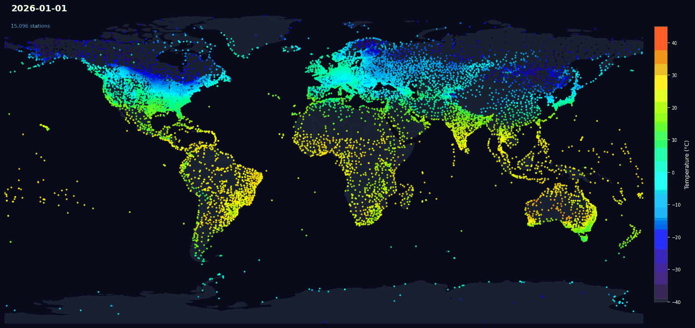

import DocCardList from '@theme/DocCardList';

# Meteostat Datasets

Meteostat provides open and free access to historical weather and climate data. Users can download full [time series](/data/timeseries/) of individual weather stations provided in **CSV** format and [bulk data](/data/bulk/) in **Parquet** format. Weather station [meta data](/data/weather-stations) is provided in **JSON** and **SQL** formats. Users are **not required to sign up** for this service.

## 👀 Learn More

<DocCardList />
