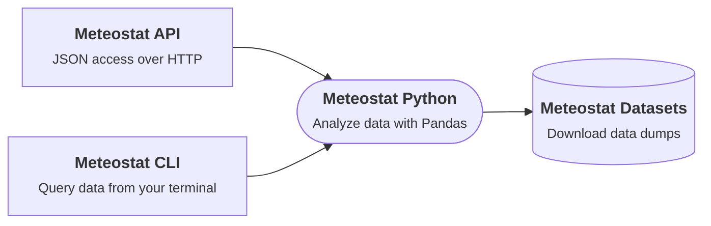

# Introduction

Meteostat is a leading provider of open weather and climate data. Access long-term time series from thousands of weather stations and integrate Meteostat data into products, applications, and workflows. With an open-data policy, Meteostat is well suited for research, education, and commercial projects.

## Our Services

Meteostat provides several interfaces for retrieving weather and climate data. [**Meteostat Python**](/python/) is the library at the core of it all — the [**API**](/api/) and [**CLI**](/cli/) are both built on top of it. The underlying [**Datasets**](/data/) can also be accessed directly. Pick whichever entry point fits your use case, or click a node below to jump straight to its docs:

## About Meteostat

National meteorological services (for example, NOAA, DWD, and Environment Canada) publish valuable climate and weather data. Each provider uses different formats and access methods, which makes combining multiple sources time consuming and error prone.

Meteostat aggregates and normalizes these datasets so you do not have to maintain ingestion routines, databases, or quality assurance pipelines. This lets you start building weather- and climate-driven applications within minutes.

Retrieve the data you need with a single HTTP request, or download complete station dumps. Meteostat supports projects ranging from small data-science experiments to university research and enterprise applications.

Unlike many other weather services, Meteostat focuses on historical, observation-based datasets measured on-site by weather stations worldwide. You can request raw station observations (no interpolation) or use point-data queries to fetch data by geographic location.
